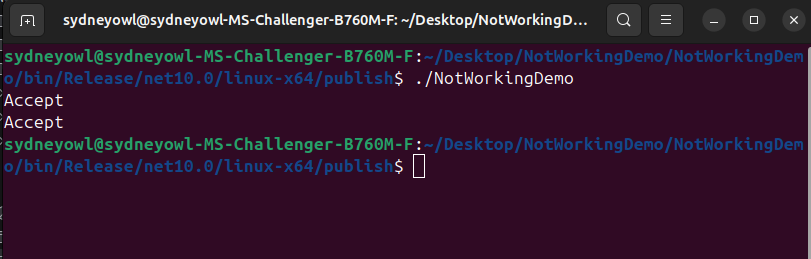
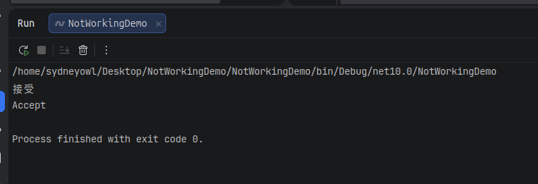

# Readme

This is a minimal project for reproducing [issue #22](https://github.com/Antelcat/I18N/issues/22). It runs normally in non-AOT mode, but fails to compile when using AOT compilation.

AOT Mode (dotnet publish  -c Release -p:TrimUnusedDependencies=true)

Non-AOT mode
